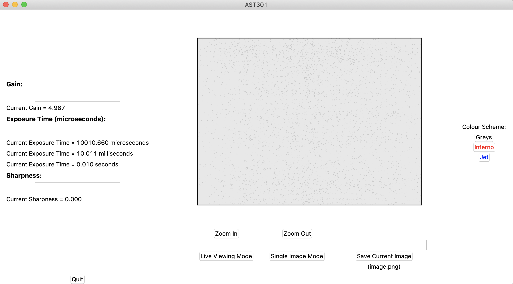
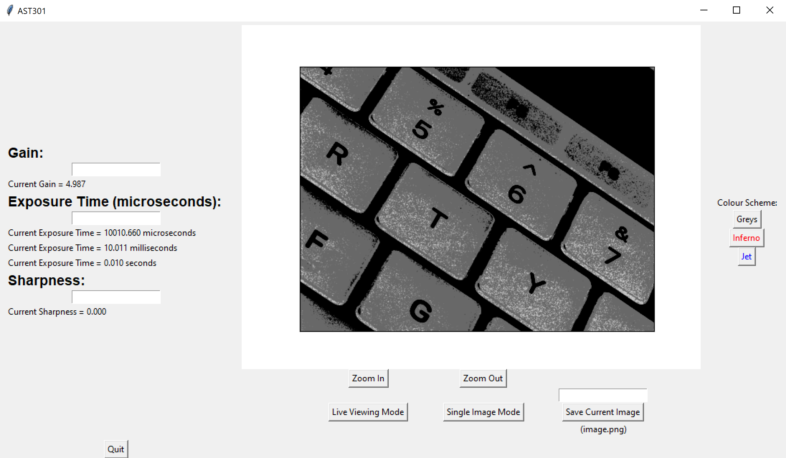

# AST301SpinnakerGUI
A Python-based GUI for the AST301 lab using a FLIR camera and the Spinnaker SDK.

This GUI is currently optimized for **Python 3**, but Python 2 support will be coming soon (if necessary).

- [Installation of required dependencies](#installation-of-required-dependencies)
- [Opening the GUI](#opening-the-gui)
- [Using the GUI](#usage)
  * [Default Setup](#default-setup)
  * [Switching between live viewing mode and single image mode](#switching-between-live-viewing-mode-and-single-image-mode)
  * [Updating the camera parameters](#updating-the-camera-parameters)
  * [Zooming in and out](#zooming-in-and-out)
  * [Saving an image](#saving-an-image)
  * [Updating the colormap](#updating-the-colormap)

## Installation of required dependencies

1. [Install the Spinnaker SDK and PySpin from FLIR.](https://www.flir.com/products/spinnaker-sdk/)
   * PySpin installation packages will be included with your Spinnaker SDK download. 
   * To install PySpin, you will have to follow the instructions provided by FLIR in these installation packages. These are available in the README.txt file that accompanies your Spinnaker SDK download. Be sure to use the PySpin installation package that matches your Spinnaker and Python verisons (for example, **spinnaker_python-2.0.0.147-cp27-cp27m-macosx_10_14_intel.tar.gz** refers to PySpin version 2.0.0.147 and Python version 2.7). It's most important to make sure that you match the correct Python and PySpin versions (rather than your computer's OS, for example). So if you have Python version 3.6, find the installation package that says "cp37" in the file name.

2. In addition to the Spinnaker SDK and PySpin, this GUI requires the following Python packages to be installed:
   * numpy
   * matplotlib
   * tkinter
   * Pillow, which is a fork of the Python Imaging Library (PIL)
    ** You can follow the installation instructions [here](https://pillow.readthedocs.io/en/stable/) if you don't already have Pillow installed. Note that Pillow is a newer, maintained version of the deprecated PIL library. 
   * [simple-pyspin](https://pypi.org/project/simple-pyspin/)

These packages can all be installed via pip through the command line:

    pip install simple-pyspin
    
## Opening the GUI

To open the GUI, you simply run the following command from the command line:

    python ast301GUI.py
    
## Usage

By default, many options available in the SpinView GUI that comes with the Spinnaker SDK are turned off and not viewable by users in this simple GUI. With this GUI, users are able to change several camera parameters (gain, exposure time, and sharpness), view images in a live viewing mode or in a single image mode, zoom in and out of images, modify the displayed image's colormap, and save the current image.

### Default Setup

When the GUI opens, the gain/exposure time/sharpness have been set to default parameters, which will be displayed in the GUI. The camera will be in single image mode by default, a static image of whatever the camera was looking at when the GUI was launched will be displayed. The default colormap is set to `Greys`, and the default name for saved images is `image.png`.

The image above shows the default view when the GUI is opened on a Mac. 

The image above shows the default view when the GUI is opened on a Windows computer.

### Switching between live viewing mode and single image mode.

The GUI allows for two separate viewing modes with the camera: a live viewing mode and a single image mode. By default the GUI starts in a static single image mode, with the display showing the camera's view at the moment the GUI was launched.

The live viewing mode shows a live view of what the camera is currently seeing. This mode can be activated by clicking the `Live Viewing Mode` button.

The single image mode shows a static image of whatever the camera was viewing at the moment the button was clicked. This mode can be activated by clicking the `Single Image Mode` button. To update the static image, simply click the `Single Image Mode` button again.

You can switch back and forth between these two modes as often as you'd like while running the GUI.

### Updating the camera parameters

The GUI allows for the camera's gain, exposure time, and sharpness to be updated. These parameters are updated in real-time, meaning that the change will be visible immediately if you are in live viewing mode. If you are in single image mode, the change will be visible when the next static image is acquired.

To update a parameter, type the desired value into the corresponding text box and press **Enter** or **Return** on your keyboard. If the parameter has updated successfully, the new value will be displayed in the GUI. Note that your desired value will be rounded to the nearest possible value allowed by the camera.

**Gain**: The camera's gain is measured in units of decibels (dB), and can range from 0 to 20 dB. Note that this is a logarithmic scale. By default, the GUI opens with a gain value of ~ 5 dB.

**Exposure Time**: The camera's exposure time is measured in units of microseconds, but the GUI displays a conversion to milliseconds and seconds as well. By default, the GUI opens with an exposure time of 10,000 microseconds.

**Sharpness**: The camera's sharpness can range in value from 0 to 4000. By default, the GUI opens with a sharpness of 4000.

### Zooming in and out

The GUI allows for the user to zoom in and out of images. This funtionality is available in both the live viewing mode and the single image mode. You can only zoom in once; if you press the button again after zooming in once, the image will not change. 

The image being displayed is technically a numpy array, and the "zoom in" feature works by plotting a sliced version of this array. 

### Saving an image

Images being displayed by the GUI can be saved using the `Save Current Image` button. The image currently displayed in the GUI is what will be saved: this is either the static image currently displayed in the single image mode, or an instantaneous snapshot of the live viewing mode. 

The GUI only allows for images to be saved in a `.png` format that will work in the `JupyterHub` notebook associated with this lab. By default, the image will be saved as `image.png`, but the file name can be saved by typing a new name into the text box above the `Save Current Image` button and pressing **Enter** or **Return** on your keyboard. This will update the name written in brackets under the `Save Current Image` button. The name currently displayed in brackets is what the image will be saved as, so make sure this is correct before clicking the `Save Current Image` button.

The user should type the file name as a name without an extension. The GUI will automatically save the image as a PNG and add the `.png` extension.

The image will be saved in the directory from which the GUI is being run.

Note that while the colormap of the GUI display can be changed, the image will be saved in a greyscale format. This is necessary in order to maintain the functionality of the associated `JupyterHub` notebook.

### Updating the colormap

The colormap is by default a greyscale (`Greys` in matplotlib), but can be updated to `inferno` or `jet` with the buttons located on the righthand side of the GUI. The update will be automatic in live viewing mode, and will be applied to the next image acquired in the single image mode. As mentioned above, the image will not save with the associated colormap, as this requires an extra axis in the image data to represent colours and will not work with the associated `JupyterHub` notebook.
